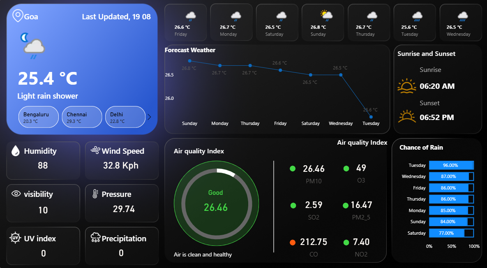

# 🌦️ Weather Dashboard

This is a simple weather dashboard that shows the current weather, forecast, air quality, and other useful details for Vijayawada, Goa, Bengaluru, Delhi, Chennai and Mumbai.

## 📌 Features
- Current weather with temperature, condition, and city selection.
- 7-day forecast with temperature trends.
- Sunrise and sunset timings.
- Air Quality Index (AQI) with detailed pollutants.
- Chance of rain percentage for upcoming days.
- Extra details:
  - Humidity
  - Wind Speed
  - Visibility
  - Pressure
  - UV Index
  - Precipitation

## 🖼️ Preview

